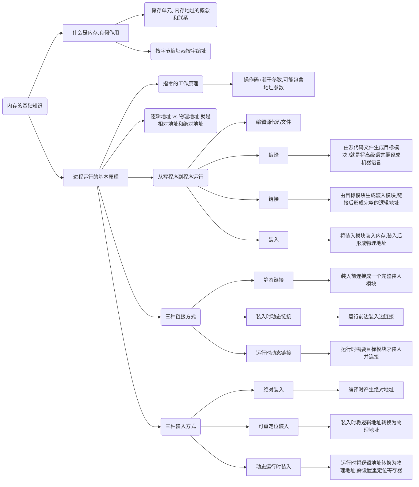

# 内存管理

---

[toc]

---

## 1. 内存的基础知识

**什么是内存？有什么作用？**

> 内存可存放数据，程序执行前，需要放到内存中才能被CPU处理—缓和CPU与硬盘之间的速度矛盾

**按字节编址**

> 每个储存单元大小为1字节(1B = 8byte)

**按字编址**

> 需要知道字长，如果字长为16位，且**按字编址**，则每个储存单元大小为一个字，16个二进制位(16byte)

**一台手机/电脑 有4GB内存什么意思**

> 2010 = 1K    220 = 1M   230 = 1G
>
> 是指该内存中可以存放 4x230个字节(B)，
>
> 如果按字节编址，则需要4x230=232个储存单元
>
> 所以地址需要用32个二进制位来表示(0~232-1)

**指令的工作原理**

> `x=x+1`编译 —>
>
> 1. 指令1(操作，参数1，参数2) 数据传送指令
> 2. 指令2(操作，参数1，参数2) 加法指令
> 3. 指令3(操作，参数1，参数2）数据传送指令

**可执行文件(*.exe)的装入(装入模块)**

> 相当于==装入模块==，是c语言经过编译、链接后所生成的模块，把装入模块放入内存里即可运行了
>
> 但是装入模块中(程序经过编译、链接后生成的指令中)，指明的都是逻辑地址
>
> 通过==三种装入方法==来解决逻辑地址到物理地址的转换问题

**绝对装入**

> 适用于单道程序环境
>
> 在编译时，如果知道程序将要放到内存中的哪个位置，编译程序将产生绝对地址的目标代码

**(静态重定位)可重定位装入**

> 静态重定位：编译、连接后的装入模块的地址都是从0开始的，指令中使用的地址、数据存放的地址都是相对于起始地址而言的逻辑地址，可根据内存的当前情况，将装入模块装入到内存的适当位置，装入时对地址进行重定位，将逻辑地址转变为物理地址(地址变换是在装入时一次完成的)
>
> 程序运行期间，无法再移动

**动态运行时装入**

> 编译、链接后的装入模块的地址都是从0开始的
>
> 装入程序把装入模块装入内存后，并不会立即吧逻辑地址转换为物理地址，而是吧地址转换推迟到程序真正要执行的时候才进行，因此装入内存后所有的地址仍然是逻辑地址
>
> 这种方式需要一个重定位寄存器的支持：
>
> > 通过逻辑地址 与 重定位地址相加来获得实际的物理地址
> >
> > 因此可以吧程序分配到不连续的存储区中

**静态链接**

> 程序运行之前，现将各个目标模块及其所需的库函数连接成一个完整的可执行文件(装入模块)，之后不再分开

**装入时动态链接**

> 将各个目标模块装入内存时，边装入，边链接

**运行时动态链接**

> 在程序执行中需要该目标模块的时候，再进行链接。
>
> 优点：便于修改和更新
>
> 缺点：每次使用某些库的时候都需要进行链接，性能有影响

**从写程序到运行**

> 编译：有编译程序将用户源代码编译成若干个目标模块(.o文件，各自的逻辑地址，都是从0开始的)，编译就是吧高级语言翻译为机器语言
>
> 链接：由链接程序将编译后形成的一组目标模块，以及所需要的库函数链接在一起，形成一个完整的装入模块
>
> 装入：由装入程序将装入模块加载进内存

